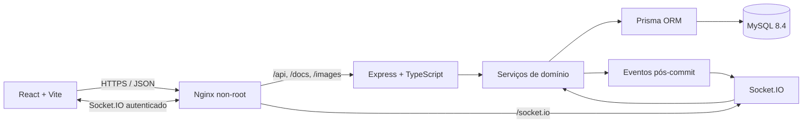
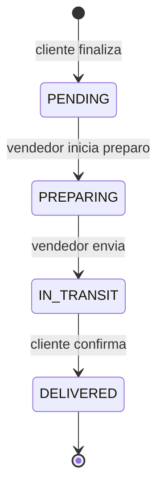
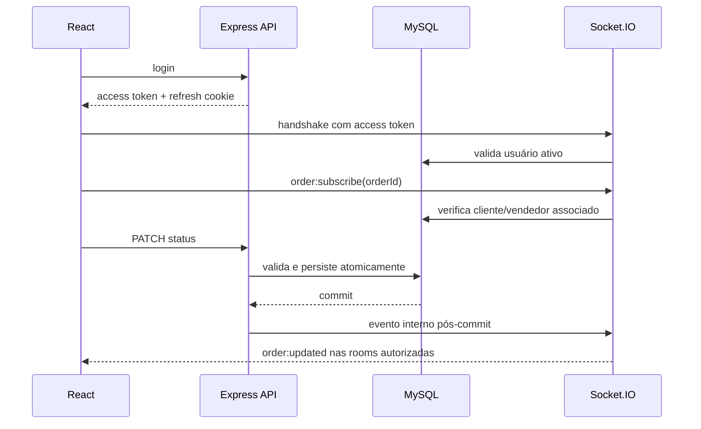
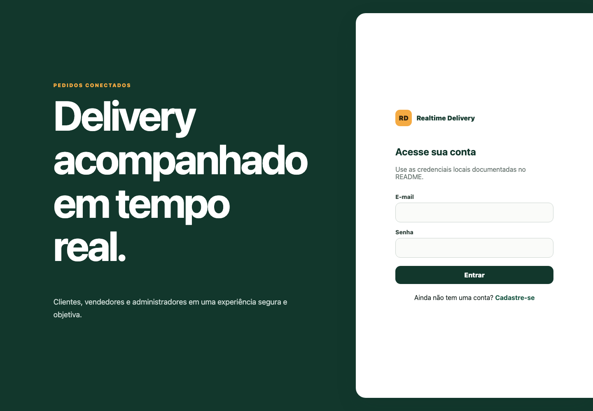
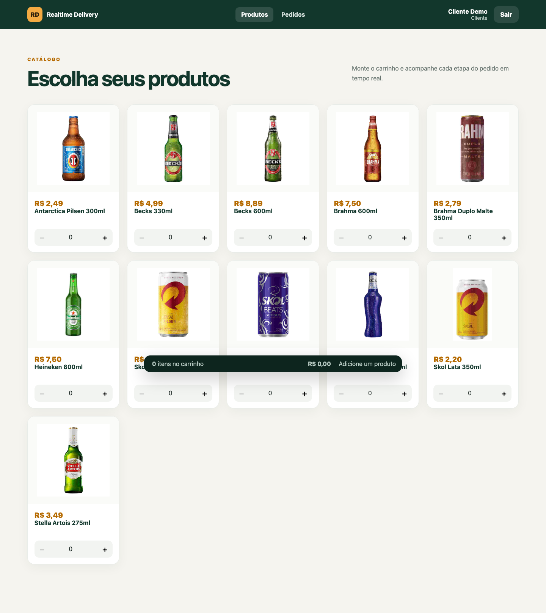
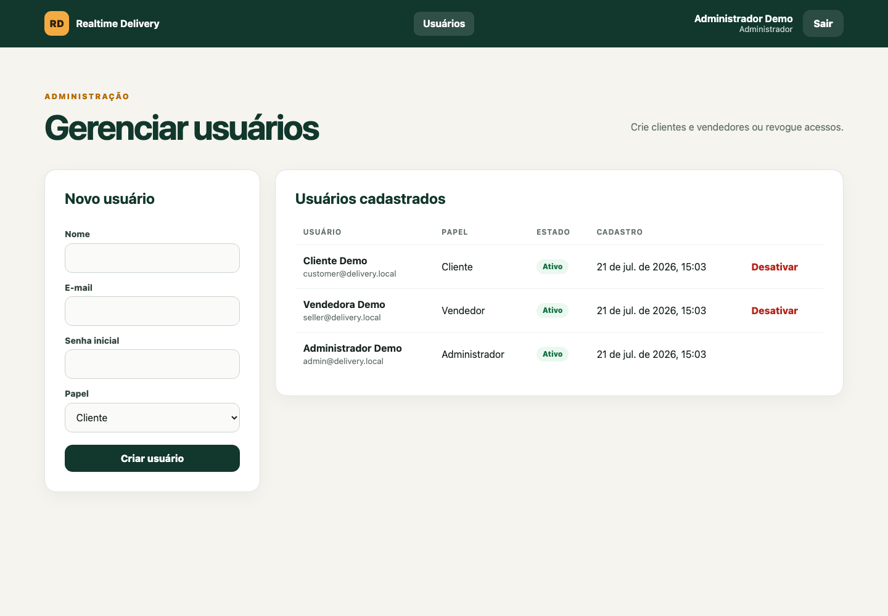

# Realtime Delivery Platform

## Plataforma Full Stack de Delivery em Tempo Real

Aplicação Full Stack para gerenciamento de pedidos de delivery, com fluxos específicos para clientes, vendedores e administradores.

A plataforma permite realizar pedidos, acompanhar sua evolução e receber atualizações de status em tempo real por meio do Socket.IO.

A implementação original foi desenvolvida colaborativamente durante a formação de Desenvolvimento Web da Trybe.

Posteriormente, o projeto foi modernizado por Leandro de Freitas Piassetta, com foco em TypeScript, segurança, controle de acesso, testes automatizados, Docker e práticas atuais de engenharia de software.

> O histórico e os créditos da implementação colaborativa original foram preservados.

## 1. Visão geral

A Realtime Delivery Platform reúne catálogo, carrinho, checkout, gestão de pedidos e administração de usuários em uma aplicação responsiva. Cliente e vendedor acompanham o mesmo pedido em tempo real, enquanto as regras de autorização e de transição permanecem no backend.

- Interface: http://localhost:3000
- API: http://localhost:3000/api/v1
- OpenAPI: http://localhost:3000/docs
- Liveness: http://localhost:3000/api/v1/health
- Readiness: http://localhost:3000/api/v1/readiness

## 2. Contexto e autoria

A primeira versão foi um projeto coletivo da formação de Desenvolvimento Web da Trybe. O histórico Git identifica esta equipe original:

- Bernardo Prado
- DiegoCS777
- Guilherme Nunes
- Jean Paulo Silva Vasconcelos
- Leandro de Freitas Piassetta
- Matheus Costa — o alias de commit `dcmatheus` usa o mesmo e-mail

Os créditos são apresentados de forma coletiva. O repositório não atribui funcionalidades específicas a participantes sem evidência documental.

## 3. Evolução da versão original

A modernização substitui a aplicação JavaScript/Sequelize por TypeScript strict, Prisma e Vite; elimina MD5, segredos JWT fixos, token em `localStorage`, confiança em preços do cliente e Socket.IO global anônimo. Também completa detalhes de pedidos, RBAC, propriedade, gestão administrativa, idempotência, Docker, CI e testes próprios.

A versão acadêmica permanece imutável na tag [`original-trybe-team-implementation`](https://github.com/leandropiasseta/realtime-delivery-platform/tree/original-trybe-team-implementation). O histórico anterior não foi reescrito.

## 4. Funcionalidades por perfil

| Perfil        | Funcionalidades                                                                                                                                        |
| ------------- | ------------------------------------------------------------------------------------------------------------------------------------------------------ |
| Cliente       | Cadastro, login, catálogo, carrinho, checkout, seleção de vendedor, próprios pedidos, detalhes, atualização em tempo real e confirmação de recebimento |
| Vendedor      | Login, pedidos associados, detalhes e transições para preparo e entrega                                                                                |
| Administrador | Login, listagem, criação de clientes/vendedores e desativação lógica com revogação de sessões                                                          |

Rotas protegidas impedem navegação por papel e a API repete a verificação no recurso real. A identidade nunca é aceita no corpo do pedido.

## 5. Arquitetura



O monorepositório mantém `back-end/` e `front-end/` como pacotes independentes, cada um com seu lockfile. A raiz orquestra qualidade, Playwright e Compose.

## 6. Segurança

- Argon2id com parâmetros explícitos e salt individual.
- Access token de 10 minutos somente em memória.
- Refresh token de 7 dias em cookie HttpOnly, `SameSite=Lax` e `Secure` em produção.
- Segredos distintos, HS256 explícito, issuer, audience, tipo, expiração, subject e JTI validados.
- Rotação de refresh token, hash SHA-256 persistido, detecção de reutilização e revogação da família.
- Cadastro público restrito a `customer`; somente administrador cria `customer` ou `seller`.
- RBAC e propriedade aplicados no backend, com resposta 404 para recurso privado alheio.
- Helmet, CORS restrito a `APP_ORIGIN`, payload limitado, rate limit de falhas de autenticação e validação Zod.
- Request ID, Pino com redaction e erros sem stack trace ou dados sensíveis.
- Total calculado no backend dentro de transação; preço unitário histórico persistido.
- Desativação lógica de usuário e revogação de suas sessões.

## 7. Fluxo dos pedidos



A atualização usa comparação atômica entre estado atual e esperado. Saltos, regressões, papéis incorretos e concorrência perdida retornam erro. `Idempotency-Key` vincula cliente, hash canônico da requisição e pedido resultante; repetir o mesmo conteúdo devolve o mesmo pedido.

## 8. Comunicação em tempo real



Sockets apenas recebem notificações. Toda mutação passa pela API. Cada conexão entra em `user:{id}`; a room `order:{id}` exige autorização e a conexão expira com o access token.

## 9. Tecnologias

| Camada   | Tecnologias                                                                                                            |
| -------- | ---------------------------------------------------------------------------------------------------------------------- |
| Frontend | React 19, TypeScript, Vite, React Router, TanStack Query, Redux Toolkit, React Hook Form, Zod, Axios, Socket.IO Client |
| Backend  | Node.js 24 LTS, Express 5, TypeScript, Prisma, Zod, Argon2id, JWT, Pino, Socket.IO                                     |
| Dados    | MySQL 8.4, Decimal, migrations e seed Prisma                                                                           |
| Testes   | Vitest, React Testing Library, Supertest e Playwright                                                                  |
| Operação | Docker multi-stage, Nginx non-root, Compose, GitHub Actions e Dependabot                                               |

## 10. Modelo de dados

| Entidade           | Responsabilidade                                       |
| ------------------ | ------------------------------------------------------ |
| `users`            | Identidade, papel, hash de senha e desativação lógica  |
| `products`         | Catálogo ativo, preço decimal e imagem relativa        |
| `orders`           | Cliente, vendedor, endereço, total e estado            |
| `order_items`      | Quantidade e preço unitário capturado no checkout      |
| `refresh_tokens`   | Hash, família, expiração, revogação e substituição     |
| `idempotency_keys` | Chave por cliente, hash da entrada e pedido resultante |

O schema usa FKs, índices por acesso frequente, constraints positivas e `DECIMAL(10,2)`; histórico de pedidos não depende do preço atual do produto.

## 11. API

Respostas de sucesso usam `{"data": ...}`; listas podem incluir `meta.count`. Erros usam `{"error":{"code","message","details","requestId"}}`. Datas são ISO UTC e dinheiro é string decimal com duas casas.

| Método   | Rota                        | Acesso                                |
| -------- | --------------------------- | ------------------------------------- |
| POST     | `/api/v1/auth/register`     | Público; cria cliente                 |
| POST     | `/api/v1/auth/login`        | Público                               |
| POST     | `/api/v1/auth/refresh`      | Cookie de refresh                     |
| POST     | `/api/v1/auth/logout`       | Cookie de refresh                     |
| GET      | `/api/v1/products`          | Cliente                               |
| GET      | `/api/v1/users/sellers`     | Cliente                               |
| GET/POST | `/api/v1/users`             | Administrador                         |
| DELETE   | `/api/v1/users/:id`         | Administrador                         |
| GET/POST | `/api/v1/orders`            | Cliente ou vendedor conforme operação |
| GET      | `/api/v1/orders/:id`        | Proprietário/associado                |
| PATCH    | `/api/v1/orders/:id/status` | Papel e estado válidos                |
| GET      | `/api/v1/health`            | Público                               |
| GET      | `/api/v1/readiness`         | Público                               |

Schemas, respostas e autenticação estão detalhados em `/docs` e `/openapi.json`.

## 12. Execução com Docker

Pré-requisitos: Docker Desktop/Engine com Compose v2.

```bash
docker compose up --build
```

O comando cria a rede, o volume MySQL, aplica migrations e inicia backend/frontend após os health checks. Para carregar dados locais demonstrativos:

```bash
docker compose --profile seed run --rm seed
```

Para encerrar sem apagar o volume:

```bash
docker compose down
```

Portas publicadas: frontend `3000`, backend `3001` e MySQL `3306` apenas em loopback. Segredos padrão do Compose são exclusivamente locais e devem ser substituídos fora do desenvolvimento.

## 13. Desenvolvimento local

Use Node.js 24 conforme `.nvmrc`.

```bash
npm ci
npm run install:all
cp back-end/.env.example back-end/.env
cp front-end/.env.example front-end/.env
npm run db:generate --prefix back-end
npm run db:deploy --prefix back-end
npm run db:seed --prefix back-end
```

Com MySQL disponível, execute em terminais separados:

```bash
npm run dev:back
npm run dev:front
```

## 14. Variáveis de ambiente

| Backend                                   | Finalidade                                      |
| ----------------------------------------- | ----------------------------------------------- |
| `NODE_ENV`, `API_PORT`, `APP_ORIGIN`      | Ambiente, porta e origem CORS                   |
| `DATABASE_URL`                            | Conexão MySQL                                   |
| `JWT_ACCESS_SECRET`, `JWT_REFRESH_SECRET` | Segredos distintos com pelo menos 32 caracteres |
| `JWT_ISSUER`, `JWT_AUDIENCE`              | Contexto obrigatório do token                   |
| `ACCESS_TOKEN_TTL`, `REFRESH_TOKEN_TTL`   | Durações, por exemplo `10m` e `7d`              |
| `COOKIE_SECURE`, `LOG_LEVEL`              | Cookie HTTPS e nível de log                     |
| `SEED_*_PASSWORD`                         | Senhas apenas do seed local                     |

| Frontend          | Finalidade                                  |
| ----------------- | ------------------------------------------- |
| `VITE_API_URL`    | Base da API; padrão same-origin `/api/v1`   |
| `VITE_SOCKET_URL` | Origem do Socket.IO; padrão same-origin `/` |

A configuração é validada ao iniciar. Arquivos `.env` são ignorados e nenhum segredo de produção pertence ao repositório.

## 15. Testes

```bash
npm test
npm run test:coverage
npm run test:e2e
```

Resultados medidos localmente em 21/07/2026:

- Backend: 13 testes unitários e 5 integrações Supertest, todos aprovados.
- Frontend: 6 testes, todos aprovados.
- E2E: 10 cenários Playwright/Chromium, todos aprovados.
- Cobertura das regras críticas no backend: 90% statements, 81,25% branches, 100% functions e 96,29% lines.
- Cobertura dos módulos críticos no frontend: 96,96% statements, 100% branches, 91,66% functions e 96,42% lines.

A integração usa MySQL real e é habilitada com `RUN_INTEGRATION=true`; a CI provisiona esse serviço automaticamente.

## 16. Qualidade

```bash
npm run lint
npm run typecheck
npm run format:check
npm run build
npm run audit
npm run docker:config
```

ESLint tipado, TypeScript strict, Prettier e thresholds de cobertura fazem parte da automação. Os três lockfiles são independentes e foram validados em Linux com Node.js 24.

## 17. CI

O workflow possui permissões `contents: read`, cancelamento concorrente e jobs separados:

- backend: MySQL, migration, seed, lint, typecheck, unitários/integração, cobertura, build e auditoria de produção;
- frontend: lint, typecheck, cobertura, build e auditoria de produção;
- Docker: validação do Compose, build e bloqueio de CVEs corrigíveis altas/críticas com Trivy;
- E2E: stack completa, Chromium, dez jornadas e artefatos em falhas.

Dependabot acompanha npm nos três pacotes, GitHub Actions e imagens Docker.

## 18. Screenshots

### Acesso



### Catálogo do cliente



### Administração



As imagens são geradas contra a stack atual com `npm run docs:screenshots`.

## 19. Decisões técnicas

- TanStack Query detém estado remoto; Redux Toolkit é usado somente no carrinho.
- A sessão e o access token ficam em memória via Context; refresh usa cookie HttpOnly e single-flight.
- Axios repete uma requisição uma única vez após renovação e limpa sessão/cache se ela falhar.
- Valores do carrinho usam centavos inteiros; persistência usa Decimal.
- Eventos internos desacoplam commit do pedido e emissão Socket.IO.
- Soft delete preserva histórico e revoga sessões.
- Nginx oferece frontend, API, documentação, imagens e Socket.IO em uma origem.
- O Compose fornecido é destinado exclusivamente ao desenvolvimento local. Em produção, use
  segredos próprios, HTTPS e `COOKIE_SECURE=true`; a API rejeita automaticamente configurações
  locais ou cookies inseguros quando `NODE_ENV=production`.

## 20. Limitações

- Não há integração com pagamento, estoque, e-mail, recuperação de senha ou MFA.
- Produtos demonstrativos são carregados por seed; ainda não existe gestão de catálogo pela interface.
- A idempotência não possui política automática de expurgo.
- O adaptador Socket.IO é em memória e atende uma instância; escala horizontal exigirá broker.
- Não há ambiente público implantado nesta entrega.
- O refresh `SameSite=Lax` pressupõe frontend e API publicados na mesma origem.

## 21. Evoluções futuras

- Pagamentos e reserva transacional de estoque.
- MFA, recuperação de conta e trilha de auditoria administrativa.
- Gestão de catálogo, upload para object storage e paginação.
- Expurgo agendado de sessões e chaves de idempotência.
- Métricas, tracing distribuído e alertas.
- Redis adapter para múltiplas instâncias de Socket.IO.
- Testes visuais e de acessibilidade automatizados.

## 22. Versão original

A implementação coletiva anterior à modernização está na tag [`original-trybe-team-implementation`](https://github.com/leandropiasseta/realtime-delivery-platform/tree/original-trybe-team-implementation), apontando para o commit `38cb3b38bf66d7cc6ab7e3f6c8709f542eeb978e`.

A tag é a referência para consultar código, README acadêmico e histórico daquele momento. Ela não deve ser movida ou sobrescrita.

## 23. Autor

Modernização posterior: **Leandro de Freitas Piassetta**.

A implementação original pertence à equipe colaborativa creditada na seção 2. Esta documentação distingue explicitamente as duas etapas e não reivindica autoria individual sobre o trabalho coletivo.
